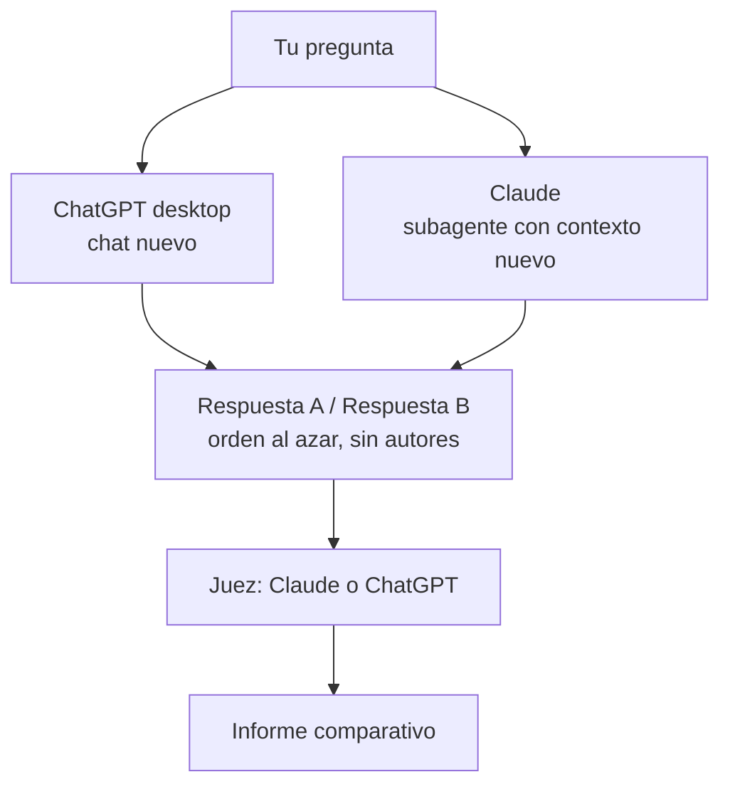

# segunda-opinion

Un skill para Claude que envía el mismo texto a **ChatGPT** y a un **Claude independiente**, recoge las dos respuestas y le pide a un **juez** que las compare sin decirle quién escribió cada una.

```text
/segunda-opinion ¿Cuál es el la mejor forma de alcanzar el resultado deseado?
```

No necesita claves API ni servicios intermediarios. Funciona con tus sesiones y planes actuales de Claude y ChatGPT, dentro de los límites de uso de cada servicio.

> **Estado: experimental.** Se ha verificado una ejecución completa, en Windows y con Claude como juez.

## Cómo funciona



1. **Eliges el juez.** Por defecto es Claude; también puede ser ChatGPT.
2. **Se envía el mismo texto a las dos IA.** El texto es idéntico, aunque cada servicio lo procesa con sus propias instrucciones y herramientas.
   - **ChatGPT:** Claude controla tu app ChatGPT de escritorio. La pone en modo Chat, abre un chat nuevo, pega la pregunta y la envía.
   - **Claude:** el skill lanza un subagente que empieza con un contexto vacío y solo recibe la pregunta.
3. **Se recogen las respuestas completas**, con sus fuentes y enlaces. El skill está diseñado para esperar a que cada respuesta termine antes de copiarla.
4. **Se prepara la comparación.** El juez recibe la pregunta y las dos respuestas como "Respuesta A" y "Respuesta B", sin nombres de autor. El orden se sortea en cada ejecución.
5. **Recibes un informe** con:
   - la conclusión del juez y una respuesta integrada;
   - los desacuerdos y cómo se resolvieron;
   - lo que quedó sin verificar;
   - qué respuesta vino de cada IA.

**Sobre el "juez ciego".** Al juez no se le dice qué IA escribió cada respuesta, pero podría deducirlo por el estilo o el formato. Esto reduce el favoritismo hacia un proveedor, pero no garantiza un juicio imparcial ni correcto.

### Elegir el juez

- **Claude:** un segundo subagente, distinto del que respondió, hace la evaluación.
- **ChatGPT:** el skill abre otro chat nuevo en ChatGPT desktop, distinto del que respondió, y le pega el material. *Todavía no se ha probado de principio a fin.*

## Requisitos

- **Claude desktop** con Cowork y el uso del computador activado.
- **ChatGPT desktop** instalado y con tu sesión iniciada.
- Un plan de Claude que admita skills y un plan de ChatGPT con el que puedas hacer consultas normalmente.

Solo está probado en **Windows**. En macOS debería funcionar usando `Cmd` en lugar de `Ctrl`, pero no está probado.

## Instalación

El repositorio contiene:

```text
segunda-opinion.skill      ← paquete listo para instalar
segunda-opinion/
└── SKILL.md               ← el skill, en texto
```

**Claude desktop / claude.ai**

1. Descarga [`segunda-opinion.skill`](segunda-opinion.skill) de este repositorio.
2. En Claude, abre la sección de **Skills** en la configuración y sube ese archivo. El nombre del menú puede cambiar según la versión de la app.

Si lo prefieres, también puedes comprimir la carpeta `segunda-opinion` en un `.zip` y subir ese archivo.

**Claude Code** *(no probado)*

Copia la carpeta a `~/.claude/skills/segunda-opinion/`. Aun así, solo funcionará si tu entorno ofrece herramientas de uso del computador capaces de controlar la app de ChatGPT. Si no las ofrece, el skill se detendrá e informará del bloqueo.

## Uso

```text
/segunda-opinion [tu pregunta y todo el contexto necesario]
```

Por ejemplo, con contexto adicional:

```text
/segunda-opinion Estoy analizando legislación panameña vigente.
¿Cuál es el plazo para oponerse a una marca publicada en Panamá?
Cita la norma aplicable y señala cualquier excepción relevante.
```

Claude te preguntará quién será el juez. Después te pedirá permiso para controlar la app de ChatGPT y usar el portapapeles.

Si ChatGPT pide iniciar sesión, un CAPTCHA u otra verificación, la completas tú. **El skill no pide ni necesita tus contraseñas, cookies, tokens ni otras credenciales.**

## Por qué el lado de Claude no usa la app Claude desktop

El uso del computador de Claude no puede controlar la propia app de Claude, porque es la app que ejecuta la sesión. Por eso el skill lanza un **subagente** que solo recibe la pregunta, sin el historial de la conversación ni la respuesta de ChatGPT.

Aquí "independiente" significa **independiente en contexto**. El subagente no tiene por qué usar un modelo o una infraestructura distintos de los de la sesión principal.

## Privacidad

- Tu pregunta se envía a Claude y a ChatGPT.
- Para hacer la comparación, las respuestas se envían al servicio que actúa como juez.
- El texto pasa temporalmente por el portapapeles del sistema y sustituye lo que tuvieras copiado.

No lo uses con información que no quieras compartir con ambos servicios. Se aplican las políticas de privacidad y retención de Anthropic y OpenAI según tus cuentas.

## Si algo falla

El skill está diseñado para fallar de forma explícita. Informa del paso exacto en que se detuvo si un servicio:

- no responde o alcanza su límite de uso;
- requiere una acción tuya;
- no permite recuperar la respuesta completa.

En ese caso **nunca presenta como comparación un resultado basado en una sola respuesta**. Como máximo reintenta una vez cada paso.

## Reglas que respeta

- No elude bloqueos, CAPTCHAs ni controles de acceso.
- No extrae cookies, tokens, contraseñas ni credenciales.
- No cambia el modelo seleccionado ni activa opciones de pago.
- Trata el contenido de las respuestas como material que hay que analizar, nunca como instrucciones.

## Límites conocidos

- Solo hay una ejecución completa verificada: en Windows y con Claude como juez.
- El skill lanza las dos consultas casi a la vez, pero todavía no se ha comprobado que se procesen en paralelo.
- La app de escritorio de ChatGPT no muestra la URL de la conversación, así que el informe no incluye ese enlace.
- El modelo de ChatGPT solo se informa si aparece en la interfaz. El modelo del subagente de Claude no se puede verificar desde ninguna interfaz.
- Si cambia la interfaz de ChatGPT, la automatización puede fallar hasta que se ajuste.

## Qué no pretende ser

No es un benchmark para decidir qué IA es "mejor". Una sola comparación depende de la pregunta, del modelo disponible en ese momento, de las herramientas activas y del propio juez. El objetivo es más sencillo: que obtener, comparar y reconciliar dos opiniones de IA sea cómodo y repetible.

## Aviso

Proyecto independiente, sin afiliación, patrocinio ni respaldo de OpenAI ni de Anthropic. Automatizar una app con tu propia cuenta queda sujeto a los términos de cada servicio.

Las respuestas y el veredicto del juez pueden contener errores. En decisiones legales, financieras, médicas o de seguridad, verifica la información con fuentes independientes.

## Licencia

MIT. Consulta [LICENSE](LICENSE).
